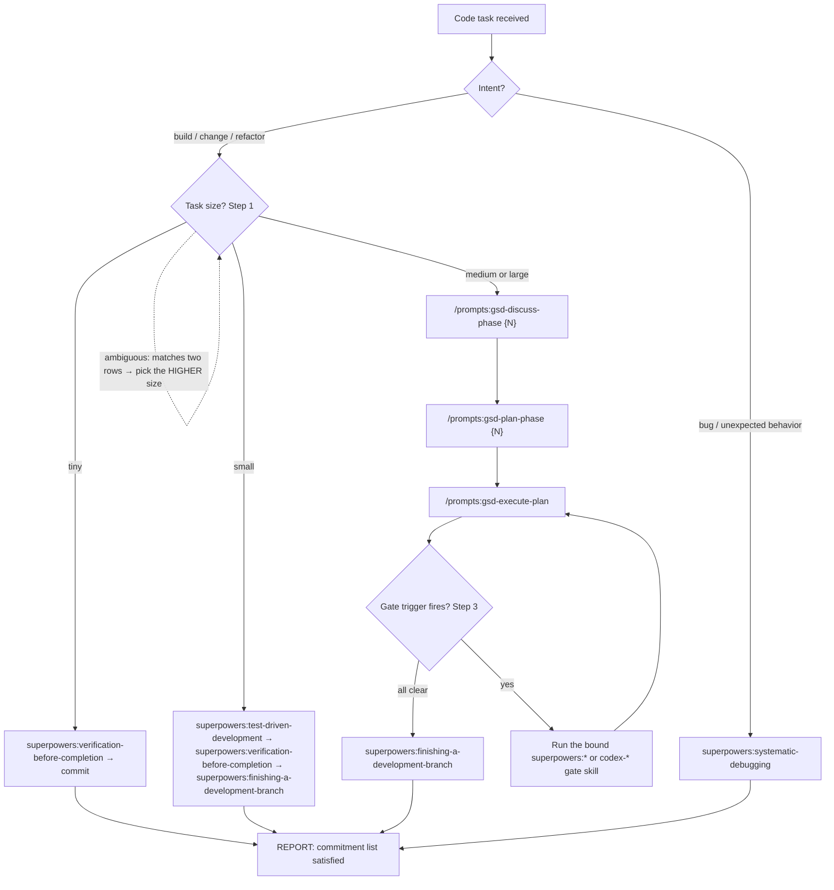

# agentic-apps-workflow

This is the trigger skill for the AgenticApps spec-first workflow on
the OpenAI Codex CLI host. It is a `full`-conformance implementation of
[`agenticapps-workflow-core`](https://github.com/agenticapps-eu/agenticapps-workflow-core)
v0.4.0. The frontmatter `implements_spec: 0.4.0` is the conformance
citation per spec/09.

This repo is a **thin binding**, not a re-port (see
[`docs/BINDING.md`](../../docs/BINDING.md) and
[ADR-0007](../../docs/decisions/0007-bind-upstream-gsd.md)). Two upstreams
provide the heavy lifting and are installed alongside this repo:

- **GSD** (`/prompts:gsd-discuss-phase` / `/prompts:gsd-plan-phase` /
  `/prompts:gsd-execute-plan`, plus roadmap/milestone/progress prompts and
  the `.planning/` project state) — from `get-shit-done-codex` (TÂCHES
  lineage), installed as Codex **prompts** under `$CODEX_HOME/prompts`.
- **Superpowers** (TDD, brainstorming, verification, code review,
  finishing-branch, systematic-debugging) — the Superpowers distribution
  for Codex. Gates that duplicate Superpowers bind to `superpowers:*`.

This repo ships only the AgenticApps layer: this trigger skill plus the
gstack/AgenticApps gates that have **no** GSD/Superpowers equivalent
(`codex-cso`, `codex-qa`, `codex-design-shotgun`, `codex-design-critique`,
`codex-database-sentinel-audit`, `codex-impeccable-audit`,
`codex-spec-review`, `codex-ts-declare-first`).

The body of this skill follows the structure required by the core
spec: the four canonical-prose blocks (Step 0, Rationalization Table,
13 Red Flags, Pressure-Test Scenarios) appear verbatim; the
declarative-contract sections (Step 1 task sizing, Step 2 routing, Step
3 gate bindings, Step 4 ADR capture, Verification Check) are
host-specific to Codex.

---

## Step 0 — The Commitment Ritual (NON-NEGOTIABLE)

As the FIRST user-facing output of your turn, before any tool call or
clarifying question, you MUST emit a `## Workflow commitment` block:

```
## Workflow commitment

I am using the agentic-apps-workflow skill for this task.
Task scope: {{one-sentence description}}
Task size: {{tiny | small | medium | large}}

Skills I will invoke, in order:
1. {{skill-name}} — {{why it applies}}
2. {{skill-name}} — {{why it applies}}
...

Post-phase gates (if applicable): {{review | cso | qa}}
Verification evidence I will produce: {{list of artifacts}}

Once I have stated this plan, I am committed to it. Deviating without
explicit user approval is a protocol violation.
```

Skipping this ritual is itself a protocol violation. You cannot rationalize
your way out of it — see the rationalization table below.

---

## Step 1 — Pick task size

Match the user's request to the smallest size that fits, then use the
required-skills column as the minimum invocation list. Sizes scale up,
not down: a "tiny" misclassification of a "medium" task is a protocol
violation.

| Size | Heuristic | Required skills (in order) |
|---|---|---|
| **Tiny** | One-line typo, comment edit, README tweak, no behavior change | `superpowers:verification-before-completion` |
| **Small** | Single-file logic change, isolated bug fix, ≤ ~20 lines diff | `superpowers:test-driven-development` → `superpowers:verification-before-completion` → `superpowers:finishing-a-development-branch` |
| **Medium** | Multi-file feature, new endpoint, new component, new test class | `/prompts:gsd-discuss-phase` → `/prompts:gsd-plan-phase` → `/prompts:gsd-execute-plan` (auto-invokes the gate skills bound in Step 3). **Mandatory (non-skippable):** the Stage-2 `code-review` gate (`superpowers:requesting-code-review`) and an ADR in `docs/decisions/` for any locked design decision |
| **Large** | Cross-cutting refactor, new service, new data shape, new infrastructure | Medium's list plus `codex-cso`, `codex-database-sentinel-audit`, `codex-impeccable-audit` per gate triggers in Step 3 |

If the request matches multiple rows, pick the higher one. The
commitment block in Step 0 names the chosen size — this commits you to
the row's invocation list.

**Medium/large enforcement (spec §6 / standard §6).** For medium and
large tasks the independent Stage-2 code-review gate is required and a
decision captured only in `CONTEXT.md` is **not** sufficient — a locked
design decision (ordering, schema, algorithm/policy choice, API shape)
MUST also land as an ADR. `superpowers:verification-before-completion`
refuses to mark the phase complete if either the review evidence or a
required ADR is missing. Tiny/small tasks are exempt.

---

## Step 2 — Route to the right entry point

AgenticApps gate skills are invoked as `$skill-name` Codex skills. The
GSD entry points are **Codex custom prompts** invoked as `/prompts:gsd-*`
— `get-shit-done-codex` (TÂCHES lineage) installs them under
`$CODEX_HOME/prompts` (e.g. `/prompts:gsd-discuss-phase`,
`/prompts:gsd-plan-phase`, `/prompts:gsd-execute-plan`, plus
`/prompts:gsd-new-project`, `/prompts:gsd-create-roadmap`,
`/prompts:gsd-progress`). This repo does **not** ship them (see ADR-0007).
Note there is **no** `gsd-quick` or `gsd-execute-phase` prompt in this
distribution (execute is `gsd-execute-plan`), and **no** `gsd-debug` —
bug tasks route straight to `superpowers:systematic-debugging`.

The Step 1 size decision and this Step 2 routing form one branchy
workflow. The flowchart below is the decision skeleton (per spec §12);
the tables that follow carry the criteria — when a task matches two
rows, judgment picks the higher one (the labeled fallback edge).



| User intent | Entry point |
|---|---|
| Tiny or small task | invoke gate skills directly per Step 1 — no GSD orchestration |
| Bug or unexpected behavior | `superpowers:systematic-debugging` (this GSD distribution ships no `gsd-debug` prompt) |
| Surface open questions before planning | `/prompts:gsd-discuss-phase {N}` |
| Author a phase plan | `/prompts:gsd-plan-phase {N}` |
| Execute a planned phase | `/prompts:gsd-execute-plan` |
| Project/roadmap bookkeeping | `/prompts:gsd-new-project`, `/prompts:gsd-create-roadmap`, `/prompts:gsd-progress` |

`{N}` is the phase number from the project's `ROADMAP.md`.
`/prompts:gsd-execute-plan` (GSD, upstream) is the heavyweight
orchestrator: it walks each plan in the phase, fires the applicable gates
from Step 3, and refuses to mark any task complete without verification
evidence (per spec/06).

---

## Step 3 — Gate-to-skill bindings

The 16 gates from
[spec/02-hook-taxonomy.md](https://github.com/agenticapps-eu/agenticapps-workflow-core/blob/main/spec/02-hook-taxonomy.md)
are bound on the Codex host as follows. This table is the host's
binding contract for `full` conformance per spec/09. Gates that have a
Superpowers equivalent bind to `superpowers:*` (installed by the
Superpowers-for-Codex distribution); the rest bind to this repo's
`codex-*` gstack gates.

### Pre-execution

| Gate | Bound skill | Notes |
|---|---|---|
| plan-review | `codex-plan-review` | Fires before the phase's first code-touching edit; writes `<NN>-REVIEWS.md` with ≥2 independent external reviewers. See `AGENTS.md` §"Pre-execution Gate — Plan Review (spec §02)" for the invocation ritual |

### Pre-phase

| Gate | Bound skill | Notes |
|---|---|---|
| `brainstorm-ui` | `superpowers:brainstorming` | Same skill covers UI and architecture; body branches on the prompt |
| `brainstorm-architecture` | `superpowers:brainstorming` | |
| `design-shotgun` | `codex-design-shotgun` | Generates ≥3 visual variants and writes them into `CONTEXT.md` |
| `design-critique` | `codex-design-critique` | Impeccable-style critique against an existing `UI-SPEC.md` |

### Per-task / execution

| Gate | Bound skill | Notes |
|---|---|---|
| `tdd` | `superpowers:test-driven-development` (strengthened by `codex-ts-declare-first` for new TS modules) | Produces a `test(RED):` + `feat(GREEN):` commit pair atomically; for a new TypeScript module's API surface (spec §13) the strengthening adds a `declare(ts):` commit before RED, giving three atomic commits `declare(ts):` → `test(ts):` (RED) → `feat(ts):` (GREEN) — refuses to collapse declare + impl into one commit |
| `ui-preview` | `codex-qa` (preview mode) | Per-task pre-commit screenshot mode of the same QA skill; the qa skill body branches on `mode=preview` vs `mode=phase-qa` |
| `verification` | `superpowers:verification-before-completion` | Refuses task completion when `must_have` evidence is missing |

### Post-phase

| Gate | Bound skill | Notes |
|---|---|---|
| `spec-review` | `codex-spec-review` | Stage 1; writes `## Stage 1 — Spec compliance` into `REVIEW.md` |
| `code-review` | `superpowers:requesting-code-review` | Stage 2; spawns an independent reviewer via `codex exec --model …` per [ADR-0002](../../docs/decisions/0002-stage2-independent-reviewer-on-codex.md). Mandatory (non-skippable) for medium/large per Step 1 |
| `security` | `codex-cso` | OWASP-aligned security audit; writes `SECURITY.md` |
| `database-security` | `codex-database-sentinel-audit` | Same skill, "in-phase" mode |
| `qa` | `codex-qa` | Phase-level browser-driven QA mode (distinct from `ui-preview` mode) |
| `impeccable-audit` | `codex-impeccable-audit` | Visual quality audit per [ADR-0011](https://github.com/agenticapps-eu/agenticapps-workflow-core/blob/main/adrs/0011-impeccable-design-quality-gate.md) |
| `db-pre-launch-audit` | `codex-database-sentinel-audit` | Same skill, "pre-launch" mode |

### Finishing

| Gate | Bound skill | Notes |
|---|---|---|
| `branch-close` | `superpowers:finishing-a-development-branch` | Composes the PR description from the phase artifacts |

The `superpowers:systematic-debugging` skill is not bound to a spec gate —
it is invoked directly for bug / unexpected-behavior tasks (this GSD
distribution ships no `gsd-debug` prompt) for the four-phase
Observe → Hypothesize → Test → Conclude protocol.

A gate fires when its trigger condition (per spec/02) is met. The
trigger skill does not pre-fire gates whose conditions cannot be met
(e.g. `database-security` is not invoked on a phase that does not
touch DB code).

---

## Step 4 — Record the decision

Every non-trivial decision lands as an ADR in
`docs/decisions/NNNN-{slug}.md`. Use the existing ADRs in
[`docs/decisions/`](../../docs/decisions/) as the shape reference (see
[ADR-0001](../../docs/decisions/0001-codex-skill-naming.md) for the
canonical layout). Generic and database-acceptance ADR templates from
`agenticapps-workflow-core/templates/` are deferred — copy from
`docs/decisions/0001-*.md` until the core templates land.

**For medium and large tasks an ADR is mandatory** whenever the phase
locks a design decision (per Step 1). A decision recorded only in the
phase `CONTEXT.md` does not satisfy the requirement;
`superpowers:verification-before-completion` treats a missing ADR as a
verification failure.

ADR-0012 governs the database-sentinel acceptance template. When that
gate fires, copy its ADR shape from
[`agenticapps-workflow-core/adrs/0012-database-sentinel-rls-audit-gate.md`](https://github.com/agenticapps-eu/agenticapps-workflow-core/blob/main/adrs/0012-database-sentinel-rls-audit-gate.md)
into `docs/decisions/` as a new numbered entry.

---

## Rationalization Table — Check Before Skipping Anything

| If you think... | The reality is... |
|---|---|
| "This task is too small for the commitment ritual" | The ritual takes 15 seconds. Skipping it is how discipline erodes. Emit the block. |
| "Skill is obvious, no need to announce it" | The announcement IS the commitment. Announcement → consistency pressure → compliance. |
| "TDD is impractical for frontend" | Snapshot tests, `/browse` screenshot diffs, visual regression count as TDD. Write the test first. |
| "I've already thought about alternatives" | If you didn't write them down, you didn't consider them. List ≥2 in RESEARCH.md. |
| "Two-stage review is excessive" | Stage 1 catches spec drift, Stage 2 catches code-quality drift. Different failures, different agents. |
| "Dev server isn't worth booting for this change" | If you touched JSX/TSX, boot it. 30 seconds. |
| "The user explicitly said ship fast" | Acknowledge urgency, explain risk in one sentence, offer minimum discipline that protects the critical path. |

---

## 13 Red Flags — STOP → DELETE → RESTART

1. Code written before the test (for TDD tasks)
2. Test added after implementation
3. Test passes on first run — no RED observed
4. Cannot explain why the test should have failed
5. Tests marked for "later" addition
6. "Just this once" reasoning
7. Manual testing claimed as verification evidence
8. Two-stage review collapsed into one
9. Framing discipline as "ritual" or "ceremony"
10. Keeping pre-written code as "reference" while writing tests
11. Sunk-cost reasoning about deleting unverified code
12. Describing discipline as "dogmatic"
13. "This case is different because..."

---

## Pressure-Test Scenarios — Self-Check

Before you skip any step, ask yourself:
- Would I skip this step if this code were running in production serving real users?
- Would a senior engineer reviewing this work accept the shortcut?
- Am I rationalizing? Check the rationalization table above.

If any answer gives you pause, follow the protocol.

---

## Verification Check (host-specific)

Before claiming any phase complete, run the following checks against
the working tree. Each check is a permitted evidence shape per
spec/06. Paths follow GSD's native phase-subdirectory layout: a phase
lives in `.planning/phases/<NN>-<slug>/` (e.g. `03-checkout/`) holding
GSD's `<NN>-CONTEXT.md`, `<NN>-<MM>-PLAN.md`, `<NN>-VERIFICATION.md`,
`<NN>-<MM>-SUMMARY.md`, etc. The AgenticApps artifacts (`REVIEW.md`,
`QA.md`, `DB-AUDIT.md`, `IMPECCABLE-AUDIT.md`, `screenshots/`) live
**inside** that same phase directory — GSD writes the plan state, the
AgenticApps layer adds its evidence alongside without reshaping it.

### Commitment block was emitted

A `.planning/phases/<NN>-<slug>/<NN>-CONTEXT.md` (or the phase summary)
contains the `## Workflow commitment` block. If the agent did not emit
it, the phase is non-conformant and Stage 1 review MUST flag it.

```bash
grep -l '^## Workflow commitment$' .planning/phases/*/*-CONTEXT.md .planning/phases/*/*-SUMMARY.md 2>/dev/null \
  || echo "MISS: commitment block not found in any phase artifact"
```

### TDD commit pairs exist for tasks marked `tdd="true"`

For each plan with `tdd="true"`, the git history MUST contain a
`test(RED):` commit followed by a `feat(GREEN):` commit (or host
equivalent prefixes per spec/02 `tdd` gate).

```bash
git log --oneline --grep '^test(RED)' | head
git log --oneline --grep '^feat(GREEN)' | head
# Both lists are expected to be non-empty for any phase containing a
# TDD-flagged plan; pair them by chronological adjacency.
```

### Stage 2 evidence is present and independent

`.planning/phases/<NN>-<slug>/REVIEW.md` contains both `## Stage 1 —
Spec compliance` and `## Stage 2 — Code quality`. Stage 2 was authored
by an independent reviewer (per spec/07) — on Codex this means a `codex
exec` child invocation logged for the phase or referenced by command in
the REVIEW file. For medium/large tasks this file is mandatory (Step 1).

```bash
phase="$1"   # e.g. 03-checkout
grep -l '^## Stage 1 — Spec compliance' ".planning/phases/${phase}/REVIEW.md" \
  && grep -l '^## Stage 2 — Code quality' ".planning/phases/${phase}/REVIEW.md" \
  || echo "MISS: REVIEW.md is missing one of the two stages"
```

### Per-`must_have` evidence in VERIFICATION.md

Every `must_have` row in `.planning/phases/<NN>-<slug>/<NN>-VERIFICATION.md`
has at least one Evidence subrow per spec/06. A `must_have` with zero
Evidence rows is a verification failure.

```bash
awk '
  /^### must_have:/ { must=$0; ev=0; next }
  /^- Evidence:/ && must { ev++ ; next }
  /^### / && must && !ev { print "MISS evidence: " must; must=""; ev=0 }
  END { if (must && !ev) print "MISS evidence: " must }
' .planning/phases/*/*-VERIFICATION.md
```

### ADR present for medium/large locked decisions

A medium/large phase that locked a design decision has a matching ADR
under `docs/decisions/`. A decision living only in the phase context is
a verification failure (Step 4).

```bash
ls docs/decisions/[0-9][0-9][0-9][0-9]-*.md >/dev/null 2>&1 \
  || echo "MISS: no ADR recorded — required for medium/large locked decisions"
```

### `implements_spec` is current

The trigger skill's frontmatter MUST cite the spec version this
project's contract is asserted against. If the project bumps to a
newer core version, update the trigger skill's frontmatter and
re-validate.

```bash
grep '^implements_spec:' "${CODEX_HOME:-$HOME/.codex}/skills/agentic-apps-workflow/SKILL.md"
```

---

## Where this skill lives at runtime

After install via this scaffolder's `install.sh` (or by symlinking the
`skills/agentic-apps-workflow/` directory into `$CODEX_HOME/skills/`),
Codex auto-discovers this SKILL.md and routes to it on any code task
matching the description in the frontmatter. `install.sh` also binds the
upstreams (GSD via `get-shit-done-codex`; Superpowers for Codex)
— see [`docs/BINDING.md`](../../docs/BINDING.md).

The skill stays loaded only during the triggering turn (per Codex's
progressive-disclosure design); subsequent turns re-trigger when the
description matches.

---

## Knowledge Capture — Ritual Tail (spec §15)

Transferable learnings must not die in a `.codex/session-handoff.md` that the
next session overwrites. This step routes them to a cross-repo memory: **one
Obsidian note per repo** in the operator's vault. It is the FINAL step of three
rituals — run it AFTER, never before, the ritual's own artifact exists:

1. **Session handoff** — after `.codex/session-handoff.md` is written.
2. **Plan completion** — after a plan is marked complete under `.planning/`
   (GSD `/prompts:gsd-plan-phase`).
3. **Phase completion** — after the phase artifacts are committed
   (GSD `/prompts:gsd-execute-plan`).

The vault write is machine-local: it MUST NEVER be committed to the repo, and
it MUST NEVER fail, block, or roll back the ritual that triggered it — on any
failure print one warning line and continue. This mirrors the same section in
the project `AGENTS.md` (root-down concat); both are the same contract, so a
session that only reads `AGENTS.md` still performs the capture.

Procedure (mechanical — follow exactly):

1. **Read the config.** Open `.planning/config.json` — the shared, host-neutral
   file, NOT `.planning/config.codex.json` — and read its `knowledge_capture`
   object. **Skip** — print at most one line
   `knowledge-capture: skipped (<reason>)` and continue the ritual — when any
   holds:
   - `.planning/config.json` is absent, or has no `knowledge_capture` block, or
   - `knowledge_capture.enabled` is `false`, or
   - the parent folder of `knowledge_capture.note` does not exist (expand a
     leading `~` against `$HOME`).
   NEVER create the parent folder: an absent vault means "not this machine",
   not "set up the vault".
2. **Distill 1–5 transferable learnings** from the ritual just completed. A
   learning qualifies ONLY if it would change how you, another agent, or
   another host works next time: gotchas whose root cause generalizes; decision
   rationale with reusable trade-offs; tooling/workflow insights (what made the
   agent fast or slow); wrong assumptions and what corrected them. Status
   updates, restatements of the plan, repo facts already in
   ADRs/handoffs/CHANGELOGs, and filler do NOT qualify. **If nothing clears the
   bar, write nothing** — no empty entries, no placeholders.
3. **Create the note on first write.** If the `knowledge_capture.note` file
   does not exist, create it from the skeleton at
   `${CODEX_HOME:-$HOME/.codex}/skills/setup-codex-agenticapps-workflow/templates/obsidian-learnings-note.md`
   (fill the `<...>` fields and the dates; `hosts:` starts as `[codex]`).
4. **Prepend a Log entry** at the TOP of `## Log` (append-only — never edit or
   delete existing entries) with a heading of exactly this shape, `codex` as
   the host tag:
   `### YYYY-MM-DD — <handoff|plan|phase> — <short title> (codex)`
   and the learnings as bullets beneath it.
5. **Curate `## Key Learnings`:** dedupe, merge related items, promote log
   entries that earned it, demote or remove stale ones. Target ~10–20
   highest-value items — each a bolded short title plus one to three sentences
   carrying the transferable insight, not the status.
6. **Update frontmatter:** set `updated:` to today's date; ensure `codex`
   appears in the `hosts:` list (add it, preserving any hosts already listed —
   e.g. `[claude]` becomes `[claude, codex]`).
7. **Report** in one or two lines what was written (or why the step skipped).

Vault safety (hard rules): touch ONLY the configured note — never other repos'
notes, the folder's `CLAUDE.md`, or anything else in the vault. Never write
secrets, tokens, URLs with embedded credentials, or client-confidential data;
redact before writing.

The destination is config-routed (spec §15.2) and the block is host-neutral, so
codex and claude running in one working tree read the **same**
`.planning/config.json → knowledge_capture` and write to the same per-repo note
(differentiated only by the `(codex)` / `(claude)` host tag in the Log heading).
See [ADR-0008](../../docs/decisions/0008-knowledge-capture.md) and core
[ADR-0017](https://github.com/agenticapps-eu/agenticapps-workflow-core/blob/main/adrs/0017-knowledge-capture-obsidian.md).

## Pre-execution Gate — Plan Review (spec §02)

Multi-AI plan review must run BEFORE execution begins. This gate exists
because agent compliance alone did not hold: core ADR-0018 records that
cparx phases 04.9 through 05 silently dropped this review for 8 consecutive
phases, with no program ever catching the omission.

Procedure (mechanical — follow exactly):

1. **When** — before the FIRST code-touching edit of a phase. Not before
   `.planning/` artifact edits; not once per edit.
2. **Run the verifier** at the stable installed path
   `${CODEX_HOME:-$HOME/.codex}/skills/agentic-apps-workflow/scripts/check-plan-review.sh`.
   Always this path — never a path read out of the target repo's own config,
   and never a relative path. The verifier locates the repo root itself, so
   invoke it from wherever you are: no working-directory precondition applies.
3. **Run it every time. Do not pre-judge whether it applies.** The agent's
   job is to invoke. The verifier's job is to decide.
4. **Exit 0 → proceed. Exit 2 → HARD STOP.** Do not edit code. Do not
   auto-invoke external reviewers on your own initiative — that would ship
   plan content to other vendors without consent. The verifier prints the
   remedy; surface it to the operator and wait.
5. **The remedy** is the `codex-plan-review` skill, which writes
   `<NN>-REVIEWS.md` with at least 2 independent external reviewers.

**The verifier decides these for you** — you do not need to check any of
these; run the script and it will exit 0 on its own when:
- `GSD_SKIP_REVIEWS=1` is set, or a `multi-ai-review-skipped` marker exists
  in the phase directory (both emergency-only, both announce themselves)
- the phase is legacy bare-number layout, already shipped (a `*-SUMMARY.md`
  is present), has no `*-PLAN.md` at all, or nothing resolves

Both `GSD_SKIP_REVIEWS` and the `multi-ai-review-skipped` marker are
emergency-only escape hatches: each announces itself, and the marker file is
visible to `git status` and expected to be committed with a rationale. A
hatch is an auditable decision, not a silent bypass.

