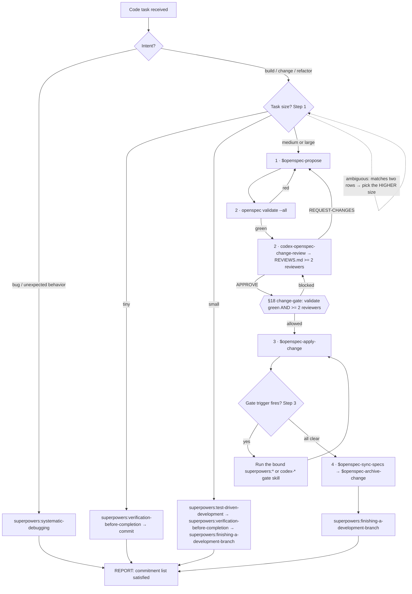

# agentic-apps-workflow

This is the trigger skill for the AgenticApps spec-first workflow on
the OpenAI Codex CLI host. It is a `full`-conformance implementation of
[`agenticapps-workflow-core`](https://github.com/agenticapps-eu/agenticapps-workflow-core)
v1.0.0. The frontmatter `implements_spec: 1.0.0` is the conformance
citation per spec/09.

The claim advanced `0.10.0 → 1.0.0` at host v1.0.0 (migration `0013`):
core spec v1.0.0 replaced the **planning** front end — §16 (OpenSpec spec
slot), §17 (lifecycle & gate mapping), §18 (retargeted change-gate), §19
(spec-vs-process placement & Linear coupling). The **execution**
discipline is unchanged: §01/§03/§04/§05/§06/§11 carry forward verbatim.
See [ADR-0011](../../docs/decisions/0011-openspec-superpowers-adoption.md).

This repo is a **thin binding**, not a re-port (see
[`docs/BINDING.md`](../../docs/BINDING.md) and
[ADR-0007](../../docs/decisions/0007-bind-upstream-gsd.md)). Two upstreams
provide the heavy lifting and are installed alongside this repo:

- **OpenSpec** — the planning front end and the spec slot
  (`openspec/specs/` + `changes/` + `changes/archive/`). A standalone,
  agent-agnostic CLI (`npm i -g @fission-ai/openspec`); agents just call
  it. `install.sh` runs `openspec init --tools codex --profile core`,
  which generates this host's command surface.
- **Superpowers** (TDD, brainstorming, verification, code review,
  finishing-branch, systematic-debugging) — the Superpowers distribution
  for Codex. Gates that duplicate Superpowers bind to `superpowers:*`.

**Installed OpenSpec CLI version: 1.6.0** (spec §16 MUST — a host records
the CLI version it implements against). Where this prose and the installed
CLI disagree on a file name or a subcommand, **the CLI wins**; the
three-slot model and the done-ness rule are what remain normative.

> **The GSD phase engine is retired as the planning driver.** GSD's
> *capabilities* moved (plan → propose, verify → Superpowers verification,
> ship → archive + the kept ship mechanics); the driver is gone. The
> `.planning/` tree is never deleted — on a target project it is retained
> as effort history (§19; see the planning→openspec recipe carried by the
> setup/update skills). This scaffolder keeps its own `.planning/` in place.

This repo ships only the AgenticApps layer: this trigger skill plus the
gstack/AgenticApps gates that have **no** OpenSpec/Superpowers equivalent
(`codex-cso`, `codex-qa`, `codex-design-shotgun`, `codex-design-critique`,
`codex-database-sentinel-audit`, `codex-impeccable-audit`,
`codex-openspec-change-review`, `codex-ts-declare-first`).

The body of this skill follows the structure required by the core
spec: the four canonical-prose blocks (Step 0, Rationalization Table,
13 Red Flags, Pressure-Test Scenarios) appear verbatim; the
declarative-contract sections (Step 1 task sizing, Step 2 routing, Step
3 gate bindings, Step 4 ADR capture, Verification Check) are
host-specific to Codex.

---

## Step 0 — The Commitment Ritual (NON-NEGOTIABLE)

As the FIRST user-facing output of your turn, before any tool call or
clarifying question, you MUST emit a `## Workflow commitment` block:

```
## Workflow commitment

I am using the agentic-apps-workflow skill for this task.
Task scope: {{one-sentence description}}
Task size: {{tiny | small | medium | large}}

Skills I will invoke, in order:
1. {{skill-name}} — {{why it applies}}
2. {{skill-name}} — {{why it applies}}
...

Post-phase gates (if applicable): {{review | cso | qa}}
Verification evidence I will produce: {{list of artifacts}}

Once I have stated this plan, I am committed to it. Deviating without
explicit user approval is a protocol violation.
```

Skipping this ritual is itself a protocol violation. You cannot rationalize
your way out of it — see the rationalization table below.

---

## Step 1 — Pick task size

Match the user's request to the smallest size that fits, then use the
required-skills column as the minimum invocation list. Sizes scale up,
not down: a "tiny" misclassification of a "medium" task is a protocol
violation.

| Size | Heuristic | Required skills (in order) |
|---|---|---|
| **Tiny** | One-line typo, comment edit, README tweak, no behavior change | `superpowers:verification-before-completion` |
| **Small** | Single-file logic change, isolated bug fix, ≤ ~20 lines diff | `superpowers:test-driven-development` → `superpowers:verification-before-completion` → `superpowers:finishing-a-development-branch` |
| **Medium** | Multi-file feature, new endpoint, new component, new test class | Open a **change**: `$openspec-propose` → `openspec validate --all` → `codex-openspec-change-review` → `$openspec-apply-change` (fires the Step 3 gates) → `$openspec-archive-change` → ship. **Mandatory (non-skippable):** the Stage-2 `code-review` gate (`superpowers:requesting-code-review`) and an ADR in `docs/decisions/` for any locked design decision |
| **Large** | Cross-cutting refactor, new service, new data shape, new infrastructure | Medium's list plus `codex-cso`, `codex-database-sentinel-audit`, `codex-impeccable-audit` per gate triggers in Step 3 |

If the request matches multiple rows, pick the higher one. The
commitment block in Step 0 names the chosen size — this commits you to
the row's invocation list.

**Tiny/small do not need a change.** The §18 gate is permissive out of a
change (no active change → allow), mirroring §02's out-of-phase
permissiveness. Medium and large DO: they change what the product
guarantees, so they get a spec delta and a review before code.

**Medium/large enforcement (spec §17).** For medium and large tasks the
independent Stage-2 code-review gate is required and a decision captured
only in the change's `design.md` is **not** sufficient — a locked design
decision (ordering, schema, algorithm/policy choice, API shape) MUST also
land as an ADR. `superpowers:verification-before-completion` refuses to
mark the change complete if either the review evidence or a required ADR
is missing. Tiny/small tasks are exempt.

---

## Step 2 — Route to the right entry point

The lifecycle has four stages (spec §17). Everything the product
guarantees moves through them in order:

**1 · propose → 2 · validate → 3 · Superpowers-execute → 4 · archive**,
then **ship** as a separate act.

### The codex command surface (verified, CLI 1.6.0)

`openspec init --tools codex --profile core` does **not** generate
`/opsx:*` slash commands on this host — it writes **six project-local
skills** into the repo's `.codex/skills/`, which Codex discovers and which
you invoke as `$<name>`:

| Skill | Lifecycle stage |
|---|---|
| `$openspec-explore` | 0 · ideate an open-ended change (optional) |
| `$openspec-propose` | 1 · propose (proposal + design + spec delta + tasks) |
| `$openspec-update-change` | 1 · amend an artifact mid-flight |
| `$openspec-apply-change` | 3 · implement the tasks |
| `$openspec-sync-specs` | 4 · fold the delta into `specs/` |
| `$openspec-archive-change` | 4 · move the change to `changes/archive/` |

This is the §16 "CLI is authoritative over prose" rule in action: the core
standard describes `/opsx:*` commands, the installed CLI generates skills
on codex, and the host records the divergence. The CLI verbs
(`openspec new change <slug>`, `validate --all`, `show`, `status`,
`list`, `archive <slug>`) work identically for any agent or human and are
the fallback if the skills are not present.

These generated skills are **regenerable output**, not vendored artifacts —
they are gitignored in this repo and recreated by `openspec init`/`update`.
Never hand-edit them.

### Routing table

| User intent | Entry point |
|---|---|
| Tiny or small task | invoke gate skills directly per Step 1 — no change needed |
| Bug or unexpected behavior | `superpowers:systematic-debugging` (a fix that changes a product guarantee still needs a change) |
| Surface open questions before proposing | `superpowers:brainstorming`, then `$openspec-explore` |
| Open a unit of product work | `$openspec-propose` (or `openspec new change <slug>`) |
| Check the change is well-formed | `openspec validate --all` |
| Get the pre-code adversarial review | `codex-openspec-change-review` (writes `REVIEWS.md`) |
| Implement the tasks | `$openspec-apply-change` + the Step 3 execution gates |
| Fold the delta and close the change | `$openspec-sync-specs` → `$openspec-archive-change` |
| Ship | `superpowers:finishing-a-development-branch` (commit / PR / changelog) |


```mermaid
flowchart TD
  start[Code task received] --> kind{Intent?}
  kind -->|bug / unexpected behavior| dbg["superpowers:systematic-debugging"]
  kind -->|build / change / refactor| size{Task size? Step 1}
  size -->|tiny| tiny[superpowers:verification-before-completion → commit]
  size -->|small| small[superpowers:test-driven-development → superpowers:verification-before-completion → superpowers:finishing-a-development-branch]
  size -->|medium or large| propose["1 · $openspec-propose"]
  size -.->|ambiguous: matches two rows → pick the HIGHER size| size
  propose --> validate["2 · openspec validate --all"]
  validate -->|red| propose
  validate -->|green| review["2 · codex-openspec-change-review → REVIEWS.md >= 2 reviewers"]
  review -->|REQUEST-CHANGES| propose
  review -->|APPROVE| gate{{"§18 change-gate: validate green AND >= 2 reviewers"}}
  gate -->|blocked| review
  gate -->|allowed| exec["3 · $openspec-apply-change"]
  exec --> gates{Gate trigger fires? Step 3}
  gates -->|yes| gaterun[Run the bound superpowers:* or codex-* gate skill]
  gaterun --> exec
  gates -->|all clear| arch["4 · $openspec-sync-specs → $openspec-archive-change"]
  arch --> close[superpowers:finishing-a-development-branch]
  tiny --> report[REPORT: commitment list satisfied]
  small --> report
  close --> report
  dbg --> report
```

**`archive ≠ ship` (spec §17, normative).** `$openspec-archive-change`
folds the delta and moves the change directory and produces **no git
commit**. Shipping is the separate git act with its own gate
(`branch-close` / PR). Never collapse the two into one step.

---

## Step 3 — Gate-to-skill bindings

Spec §17 remaps the §02 gate taxonomy onto the OpenSpec lifecycle with
three fates: **collapsed** (a lifecycle stage now does the job),
**retained** (survives unchanged as an execution gate), **conditional**
(retained, fires only on its trigger). This table is the host's binding
contract for `full` conformance per spec/09.

### Collapsed into stage 2 (validate)

| §02 gate | Where it lives now |
|---|---|
| `spec-review` | `openspec validate --all` — the machine check of the delta against the spec slot. The `codex-spec-review` skill is deleted. |
| `plan-review` | The §18 change-gate **predicate**: validate green AND `REVIEWS.md` ≥ 2 reviewers, produced by `codex-openspec-change-review`. It is **not** a separately-named gate — §17 forbids that under 1.0.0 — but the adversarial multi-AI review itself is fully retained. |

### Retained — always

| Gate | Bound skill | Notes |
|---|---|---|
| `tdd` | `superpowers:test-driven-development` (strengthened by `codex-ts-declare-first` for new TS modules) | `test(RED):` + `feat(GREEN):` commit pair, atomically. For a new TypeScript module's API surface (spec §13) the strengthening adds a `declare(ts):` commit before RED — three atomic commits, never collapsed |
| `verification` | `superpowers:verification-before-completion` | Refuses task completion when `must_have` evidence is missing (spec §06) |
| `code-review` | `superpowers:requesting-code-review` | Stage 3, independent context via `codex exec --model …` per [ADR-0002](../../docs/decisions/0002-stage2-independent-reviewer-on-codex.md). **`validate` is a spec check, not a code review, and never discharges this.** Mandatory for medium/large |
| `security` | `codex-cso` | **Always-on** for product repos. Fires on any change touching auth, storage, request handling, secrets, or an LLM trust boundary. Carries §14's evidence obligation on LLM-scoped changes. Never conditional-away |
| `branch-close` | `superpowers:finishing-a-development-branch` | Stage 4 ship. The PR body links the archived change (`changes/archive/<date>-<slug>/`) and its evidence |

### Conditional — fires only when the change's surface triggers it

| Gate | Bound skill | Trigger |
|---|---|---|
| `brainstorm-ui` | `superpowers:brainstorming` | The change has a UI surface; feeds `design.md` |
| `brainstorm-architecture` | `superpowers:brainstorming` | The change adds a service / model / integration / data shape |
| `design-shotgun` | `codex-design-shotgun` | UI change with no design contract yet (≥3 variants) |
| `design-critique` | `codex-design-critique` | UI change with an existing design contract |
| `impeccable-audit` | `codex-impeccable-audit` | The change alters a shipping visual surface — retained on the ADR-0021 **measured trial** (MEASUREMENT.md), not on conviction |
| `ui-preview` | `codex-qa` (preview mode) | A frontend component / route / visual surface changed |
| `qa` | `codex-qa` (phase-qa mode) | The change ships user-visible behavior AND a dev server is reachable |
| `database-security` | `codex-database-sentinel-audit` (in-phase) | The change touches SQL, schema, RLS, definer functions, or storage policy |
| `db-pre-launch-audit` | `codex-database-sentinel-audit` (pre-launch) | Before first production launch / after a major DB migration |

### Demoted to a lint

| Gate | Binding |
|---|---|
| `ts-declare` (§13) | `codex-ts-declare-first` runs as a **CI lint / tdd-strengthener** on TS changes, not a standalone gate |

The `superpowers:systematic-debugging` skill is not bound to a spec gate —
it is invoked directly for bug / unexpected-behavior tasks for the
four-phase Observe → Hypothesize → Test → Conclude protocol.

A gate fires when its trigger condition is met. The trigger skill does not
pre-fire gates whose conditions cannot be met (e.g. `database-security` is
not invoked on a change that does not touch DB code).

---

## Step 4 — Record the decision

Every non-trivial decision lands as an ADR in
`docs/decisions/NNNN-{slug}.md`. Use the existing ADRs in
[`docs/decisions/`](../../docs/decisions/) as the shape reference (see
[ADR-0001](../../docs/decisions/0001-codex-skill-naming.md) for the
canonical layout).

**For medium and large tasks an ADR is mandatory** whenever the change
locks a design decision (per Step 1). A decision recorded only in the
change's `design.md` does not satisfy the requirement;
`superpowers:verification-before-completion` treats a missing ADR as a
verification failure.

**Placement (spec §19).** Before writing prose, ask: *is this a product
guarantee, or a way of working?* A product guarantee — something a user or
downstream system can rely on, that would be a bug if violated — belongs in
`openspec/specs/<capability>/spec.md` as a requirement. A way of working
belongs in `AGENTS.md` as process. A record of past effort belongs in
history (`docs/legacy-planning/` on a migrated project). An ADR is
process/record; the product invariants it references are what get
normatively specified.

ADR-0012 governs the database-sentinel acceptance template. When that
gate fires, copy its ADR shape from
[`agenticapps-workflow-core/adrs/0012-database-sentinel-rls-audit-gate.md`](https://github.com/agenticapps-eu/agenticapps-workflow-core/blob/main/adrs/0012-database-sentinel-rls-audit-gate.md)
into `docs/decisions/` as a new numbered entry.

---

## Rationalization Table — Check Before Skipping Anything

| If you think... | The reality is... |
|---|---|
| "This task is too small for the commitment ritual" | The ritual takes 15 seconds. Skipping it is how discipline erodes. Emit the block. |
| "Skill is obvious, no need to announce it" | The announcement IS the commitment. Announcement → consistency pressure → compliance. |
| "TDD is impractical for frontend" | Snapshot tests, `/browse` screenshot diffs, visual regression count as TDD. Write the test first. |
| "I've already thought about alternatives" | If you didn't write them down, you didn't consider them. List ≥2 in the change's `design.md`. |
| "Two-stage review is excessive" | Stage 2 catches spec drift before code; stage 3 catches code-quality drift. Different failures, different agents. |
| "Dev server isn't worth booting for this change" | If you touched JSX/TSX, boot it. 30 seconds. |
| "The user explicitly said ship fast" | Acknowledge urgency, explain risk in one sentence, offer minimum discipline that protects the critical path. |
| "`openspec validate` is green, so the change is reviewed" | `validate` is a lint over structure. It reads no intent and no code. The review is a separate, independent condition. |

---

## 13 Red Flags — STOP → DELETE → RESTART

1. Code written before the test (for TDD tasks)
2. Test added after implementation
3. Test passes on first run — no RED observed
4. Cannot explain why the test should have failed
5. Tests marked for "later" addition
6. "Just this once" reasoning
7. Manual testing claimed as verification evidence
8. Two-stage review collapsed into one
9. Framing discipline as "ritual" or "ceremony"
10. Keeping pre-written code as "reference" while writing tests
11. Sunk-cost reasoning about deleting unverified code
12. Describing discipline as "dogmatic"
13. "This case is different because..."

---

## Pressure-Test Scenarios — Self-Check

Before you skip any step, ask yourself:
- Would I skip this step if this code were running in production serving real users?
- Would a senior engineer reviewing this work accept the shortcut?
- Am I rationalizing? Check the rationalization table above.

If any answer gives you pause, follow the protocol.

---

## Verification Check (host-specific)

Before claiming any change complete, run the following checks against
the working tree. Each check is a permitted evidence shape per spec/06.
A change lives in `openspec/changes/<slug>/` and holds the CLI's
artifacts (`proposal.md`, `design.md`, the spec delta, `tasks.md`) plus
the AgenticApps evidence written alongside them (`REVIEWS.md`,
`REVIEW.md`, `SECURITY.md`, `QA.md`, `DB-AUDIT.md`,
`IMPECCABLE-AUDIT.md`, `screenshots/`) — OpenSpec owns the change state,
the AgenticApps layer adds its evidence without reshaping it.

### The change validates

```bash
openspec validate --all || echo "MISS: the spec delta does not validate"
```

### Commitment block was emitted

The change's `proposal.md` (or `design.md`) contains the
`## Workflow commitment` block. If the agent did not emit it, the change
is non-conformant and the stage-3 review MUST flag it.

```bash
grep -l '^## Workflow commitment$' openspec/changes/*/proposal.md openspec/changes/*/design.md 2>/dev/null \
  || echo "MISS: commitment block not found in any change artifact"
```

### Pre-code review evidence exists and is independent

```bash
for d in openspec/changes/*/; do
  case "$d" in openspec/changes/archive/) continue ;; esac
  n=$(grep -cE '^##[[:space:]]+Reviewer:' "$d/REVIEWS.md" 2>/dev/null || echo 0)
  [ "$n" -ge 2 ] || echo "MISS: $d has $n/2 reviewers — the §18 gate will block code edits"
done
```

### TDD commit pairs exist for tasks marked `tdd="true"`

```bash
git log --oneline --grep '^test(RED)' | head
git log --oneline --grep '^feat(GREEN)' | head
# Both lists are expected to be non-empty for any change containing a
# TDD-flagged task; pair them by chronological adjacency.
```

### Stage-3 code review is present and independent

`openspec/changes/<slug>/REVIEW.md` records the independent code-quality
review of the implementation diff (spec §07) — on Codex a `codex exec`
child invocation logged for the change or referenced by command in the
file. For medium/large this file is mandatory (Step 1).

```bash
grep -l '^## Code quality' openspec/changes/*/REVIEW.md 2>/dev/null \
  || echo "MISS: no independent stage-3 code review recorded"
```

### Every task is checked off with evidence

Every task in `tasks.md` is complete, and each carries at least one
evidence line per spec/06. A completed task with zero evidence is a
verification failure.

```bash
grep -n '^- \[ \]' openspec/changes/*/tasks.md 2>/dev/null \
  && echo "MISS: open tasks remain in the active change"
```

### ADR present for medium/large locked decisions

```bash
ls docs/decisions/[0-9][0-9][0-9][0-9]-*.md >/dev/null 2>&1 \
  || echo "MISS: no ADR recorded — required for medium/large locked decisions"
```

### The change reached done-ness before archiving (spec §16)

A change is *done* only when **both** hold: the delta is folded into
`openspec/specs/<capability>/spec.md`, **and** `openspec validate --all`
is green. Folded-but-not-archived and archived-but-not-folded are both
non-conforming half-states.

```bash
openspec list 2>/dev/null
ls openspec/changes/archive/ 2>/dev/null
```

### `implements_spec` is current

```bash
grep '^implements_spec:' "${CODEX_HOME:-$HOME/.codex}/skills/agentic-apps-workflow/SKILL.md"
```

---

## Where this skill lives at runtime

After install via this scaffolder's `install.sh` (or by symlinking the
`skills/agentic-apps-workflow/` directory into `$CODEX_HOME/skills/`),
Codex auto-discovers this SKILL.md and routes to it on any code task
matching the description in the frontmatter. `install.sh` also binds the
upstreams (the OpenSpec CLI + its generated command surface; Superpowers
for Codex) and installs the §18 change-gate — see
[`docs/BINDING.md`](../../docs/BINDING.md) and
[`docs/WORKFLOW.md`](../../docs/WORKFLOW.md).

The skill stays loaded only during the triggering turn (per Codex's
progressive-disclosure design); subsequent turns re-trigger when the
description matches.

---

## Session handoff

`.codex/session-handoff.md` is the primary continuity mechanism across sessions —
it survives context resets and `--resume`.

**At session start:** check for `.codex/session-handoff.md`. If it exists and was
modified in the last 7 days, read it before doing anything else and confirm what
was found. **Only read the codex handoff** — do NOT read a bare root
`session-handoff.md` or another host's (e.g. the opencode host's, which lives
under its own marker dir). Handoffs are host-scoped so several hosts can share
one working tree without cross-contaminating context.

**Before ending any session** — when asked to exit, when the final task is done,
or when context is getting full — write `.codex/session-handoff.md`:

```markdown
# Session Handoff — [date]

## Accomplished
- ...

## Decisions
- decision — why

## Files modified
- path — what changed

## Next session: start here
One paragraph on exactly where to pick up and what the first action should be.

## Open questions
- ...
```

Keep it under 150 lines. Write the file directly — do not print it to the
terminal. Reference the **active change** (`openspec/changes/<slug>/`) rather
than a GSD phase — `STATE.md` and the phase engine are gone.

The knowledge-capture ritual tail below runs **after** the handoff is written,
never before.

---

## Instruction surface — eager vs lazy (spec §12)

Spec 0.10.0 added an "Instruction-surface economy" SHOULD to §12: the
always-loaded instruction file is re-billed on every turn, so it carries only
what must be resident on *every* turn. Spec §19 extends the same test one step
further — a *product guarantee* belongs in the spec slot, not in either file.

`AGENTS.md` therefore carries the §11 canonical block (verbatim, behind its
provenance anchor, near the top) plus two short pointers — this skill, and the
session-handoff protocol. Everything procedural lives **here**, in the lazily
loaded trigger skill, which loads on exactly the code-touching turns where those
procedures bind: the Step 3 gate-binding table, Step 1 task-size routing, the
session-handoff protocol, the §15 knowledge-capture ritual tail, and the stage-2
change-review procedure.

Before v0.9.0 all of it was duplicated into `AGENTS.md` — ~150 eager lines per
turn, pushing the §11 block toward the mid-context position §12's placement
advisory exists to avoid. The review *procedure* moved; its **enforcement** did
not. That gate is enforced programmatically by a `PreToolUse` hook
(`.codex/hooks.json` → `hook-wrapper-openspec-gate.sh` →
`openspec-change-gate.sh`, exit 0 = ALLOW / exit 2 = BLOCK), and §12 is explicit
that hook wiring stays where the runtime needs it. Both files are untouched by
the relocation.

---

## Spec deltas (spec 1.0.0)

Per core spec §09, a host names every requirement it does not satisfy verbatim,
with rationale. Audited 2026-07-24; re-audited 2026-07-25 for §18 (ADR-0012).

- **§18 change-gate — satisfied, and no longer implemented here.**
  `bin/openspec-change-gate.sh` is vendored **byte-identical** from core's
  reference implementation (core#33 / ADR-0022), alongside
  `tools/change-gate-conformance.sh`; provenance is recorded in
  `tools/core-vendor.manifest` rather than a header, because a "vendored from
  `<commit>`" comment would break the byte-identity it claimed to record.
  Conformance is **executed, not asserted**: CI scores every declared harness
  row before the gate's verdict is trusted, and the bar is zero failures rather
  than a fixed count so a grown harness raises it automatically. All three
  surfaces use real mode dispatch — hook, `--pre-commit`, `--ci` — and `--ci` is
  whole-repo. The prior hand-maintained copy scored 16 of 28 and carried three
  live bypasses; the two defects core's harness does *not* cover (GAP-1, GAP-4)
  are pinned by assertions this repo owns. **Residual, disclosed:** the shared
  `~/.agenticapps/bin/` path is written by all four hosts and only this one
  arbitrates by `# gate-version:` so far, so a sibling can still overwrite it for
  every other repo on the machine. This host's own surfaces are defended — they
  reject an unmarked shared copy and fall back to the vendored one — but a
  marked-but-older sibling copy is still trusted. Closing it fully needs all four
  hosts adopted (core#34).

- **§14 prompt-injection — trivially conformant.** This scaffolder builds no LLM
  prompts from non-self-authored values, so §14's trigger condition cannot occur;
  §09 requires only that the host say so. The repo is markdown and shell; the
  skills it ships are prose the agent reads, not prompts assembled from untrusted
  input, and the only TypeScript is inert template fixtures under
  `skills/codex-ts-declare-first/templates/`. Downstream projects that *do* build
  prompts get §14 coverage via the `injection-guard` skill
  (agenticapps-observability), on the same delegation basis as §10. The `security`
  gate still carries §02's obligation to record §14 evidence when it fires on a
  project with a prompt-building surface. One §14-adjacent control IS live here:
  `codex-openspec-change-review` writes an untrusted-content notice above every
  verbatim third-party reviewer block, because reviewer output is exactly the
  class of text a later agent could otherwise read as instructions.
- **Nine spec/17 conditional gates whose trigger cannot occur here**
  (`brainstorm-ui`, `design-shotgun`, `design-critique`, `ui-preview`, `qa`,
  `impeccable-audit`, `database-security`, `db-pre-launch-audit`, and the
  `ts-declare` lint) are bound for downstream projects but never fire on this
  UI-less, DB-less, TS-less scaffolder. Enumerated with rationale in
  [docs/ENFORCEMENT-PLAN.md](../../docs/ENFORCEMENT-PLAN.md). Per spec/09 an
  omission whose trigger cannot occur does not downgrade `full` to `partial`.
- **§16 spec slot — initialized, not yet seeded.** `install.sh` runs
  `openspec init --tools codex --profile core`, producing the three-slot layout.
  This scaffolder's own product surface is a workflow standard rather than a
  running system, so `specs/` is seeded as the repo adopts the lifecycle for its
  own work; the slot, the gate, and the lifecycle are installed and enforced from
  1.0.0. Target projects seed `specs/` via the planning→openspec recipe carried
  by the setup/update skills (§16 SHOULD).
- **§19 `.planning/` retention — this scaffolder keeps its own in place.** §19's
  Tier-0 move to `docs/legacy-planning/` binds a *product* repo adopting the spec
  slot. This repo's `.planning/` is its own development history, its migration
  tests read fixtures out of it, and the core standard's own guardrail is "keep
  `.planning/` as backup". It is retained unmoved, and never deleted.
- **§10 observability — satisfied by delegation**, not omitted: the generator
  obligation is met by the standalone `agenticapps-observability` skill. A
  satisfied MUST per §09, not a delta — recorded here only because readers look
  for it.
- **§08 setup — satisfied by replay.** This host installs by walking the
  `0000`→latest migration chain, not by installing a prebuilt snapshot. Replay is
  §08's first-listed strategy, so the v0.9.0 amendment's drift-guard obligation
  (which binds snapshot installers) does not apply here.

---

## Knowledge Capture — Ritual Tail (spec §15)

Transferable learnings must not die in a `.codex/session-handoff.md` that the
next session overwrites. This step routes them to a cross-repo memory: **one
Obsidian note per repo** in the operator's vault. It is the FINAL step of three
rituals — run it AFTER, never before, the ritual's own artifact exists:

1. **Session handoff** — after `.codex/session-handoff.md` is written.
2. **Change archived** — after `$openspec-archive-change` moves the change into
   `openspec/changes/archive/<date>-<slug>/` (this replaces the 0.x "plan
   completion" and "phase completion" triggers, which had no equivalent once the
   phase engine retired).
3. **Ship** — after the change's work is committed / the PR is opened.

The vault write is machine-local: it MUST NEVER be committed to the repo, and
it MUST NEVER fail, block, or roll back the ritual that triggered it — on any
failure print one warning line and continue. This section is the **only** copy
of the contract: it lived in duplicate in the project `AGENTS.md` until v0.9.0,
when spec 0.10.0's instruction-surface economy convention moved it here, where it
loads on exactly the code-touching turns that can trigger it.

Procedure (mechanical — follow exactly):

1. **Read the config.** Open `.planning/config.json` — the shared, host-neutral
   file, NOT `.planning/config.codex.json` — and read its `knowledge_capture`
   object. **Skip** — print at most one line
   `knowledge-capture: skipped (<reason>)` and continue the ritual — when any
   holds:
   - `.planning/config.json` is absent, or has no `knowledge_capture` block, or
   - `knowledge_capture.enabled` is `false`, or
   - the parent folder of `knowledge_capture.note` does not exist (expand a
     leading `~` against `$HOME`).
   NEVER create the parent folder: an absent vault means "not this machine",
   not "set up the vault".
2. **Distill 1–5 transferable learnings** from the ritual just completed. A
   learning qualifies ONLY if it would change how you, another agent, or
   another host works next time: gotchas whose root cause generalizes; decision
   rationale with reusable trade-offs; tooling/workflow insights (what made the
   agent fast or slow); wrong assumptions and what corrected them. Status
   updates, restatements of the plan, repo facts already in
   ADRs/handoffs/CHANGELOGs, and filler do NOT qualify. **If nothing clears the
   bar, write nothing** — no empty entries, no placeholders.
3. **Create the note on first write.** If the `knowledge_capture.note` file
   does not exist, create it from the skeleton at
   `${CODEX_HOME:-$HOME/.codex}/skills/setup-codex-agenticapps-workflow/templates/obsidian-learnings-note.md`
   (fill the `<...>` fields and the dates; `hosts:` starts as `[codex]`).
4. **Prepend a Log entry** at the TOP of `## Log` (append-only — never edit or
   delete existing entries) with a heading of exactly this shape, `codex` as
   the host tag:
   `### YYYY-MM-DD — <handoff|change|ship> — <short title> (codex)`
   and the learnings as bullets beneath it.
5. **Curate `## Key Learnings`:** dedupe, merge related items, promote log
   entries that earned it, demote or remove stale ones. Target ~10–20
   highest-value items — each a bolded short title plus one to three sentences
   carrying the transferable insight, not the status.
6. **Update frontmatter:** set `updated:` to today's date; ensure `codex`
   appears in the `hosts:` list (add it, preserving any hosts already listed —
   e.g. `[claude]` becomes `[claude, codex]`).
7. **Report** in one or two lines what was written (or why the step skipped).

Vault safety (hard rules): touch ONLY the configured note — never other repos'
notes, the folder's `CLAUDE.md`, or anything else in the vault. Never write
secrets, tokens, URLs with embedded credentials, or client-confidential data;
redact before writing.

The destination is config-routed (spec §15.2) and the block is host-neutral, so
codex and claude running in one working tree read the **same**
`.planning/config.json → knowledge_capture` and write to the same per-repo note
(differentiated only by the `(codex)` / `(claude)` host tag in the Log heading).
See [ADR-0008](../../docs/decisions/0008-knowledge-capture.md) and core
[ADR-0017](https://github.com/agenticapps-eu/agenticapps-workflow-core/blob/main/adrs/0017-knowledge-capture-obsidian.md).

## Stage 2 — Validate + multi-AI change review (spec §17 / §18)

*(This section is the 1.0.0 retarget of what was `## Pre-execution Gate — Plan
Review (spec §02)` through v0.9.0. The gate did not go away; its target moved
from a GSD `*-PLAN.md` to the active OpenSpec change.)*

Independent multi-AI review must run BEFORE any code is written. This gate
exists because agent compliance alone did not hold: core ADR-0018 records that
cparx phases 04.9 through 05 silently dropped this review for 8 consecutive
phases, with no program ever catching the omission.

Procedure (mechanical — follow exactly):

1. **When** — after `openspec validate --all` is green for the active change,
   and before the FIRST code-touching edit. Not before edits to the change's
   own artifacts (those are exempt); not once per edit.
2. **The enforcement surface is `openspec-change-gate.sh`**, resolved at
   `$HOME/.agenticapps/bin/openspec-change-gate.sh` (or `$OPENSPEC_CHANGE_GATE`,
   or the repo's `bin/`). It reads a tool-call payload on stdin and exits
   **0 = ALLOW / 2 = BLOCK**. You do not need to pre-judge whether the gate
   applies — the `PreToolUse` hook invokes it on every `apply_patch`, and the
   git `pre-commit` hook and CI invoke it again on every commit and PR.
3. **Exit 0 → proceed. Exit 2 → HARD STOP.** Do not edit code. Do not
   auto-invoke external reviewers on your own initiative — that would ship
   change content to other vendors without consent. The gate prints the remedy;
   surface it to the operator and wait.
4. **The remedy** is the `codex-openspec-change-review` skill, which writes
   `openspec/changes/<slug>/REVIEWS.md` with at least 2 independent external
   reviewers, one `## Reviewer: <vendor>` heading each.

**The gate decides these for you** — run it and it exits 0 on its own when:
- there is no active change (out-of-change edits are permitted, §18), or
- the edit targets an OpenSpec artifact (`openspec/**`) — you must be able to
  author the change while the gate is engaged, or
- `GSD_SKIP_REVIEWS=1` is set (an emergency escape that announces itself in the
  log), or
- stdin is unparseable — the gate fails **open on parse error only**. Failing
  open on *policy* (a missing review) would be non-conformant.

`GSD_SKIP_REVIEWS` is an emergency-only escape hatch: it announces itself in
the gate's log line and in `git commit`'s output. A hatch is an auditable
decision, not a silent bypass.

**Two facts about the codex wiring that must not be "simplified" away.** The
hook calls `hook-wrapper-openspec-gate.sh`, not the gate directly, because
(1) codex's `apply_patch` payload carries the target path *inside the patch
blob* (`tool_input.command`), where the gate's extractor cannot see it — handed
the raw payload the gate parses no path and fails open, allowing every edit; and
(2) a codex `PreToolUse` hook emitting invalid stdout fails open and runs the
tool anyway, so a block must be emitted as strictly valid
`permissionDecision: deny` JSON. Both are verified behaviours, not theory.

**An installed hook is not an enforcing hook.** codex-cli requires the operator
to *trust* a project hook before it runs; an untrusted entry sits at
`Installed N / Active N-1 / Review 1` and enforces nothing while looking
installed. After wiring, confirm with `/hooks` that the entry is **Active**, and
confirm the entry uses the nested `{"matcher", "hooks":[{"type","command"}]}`
shape — the flat form is dropped silently, with no error and no warning.
